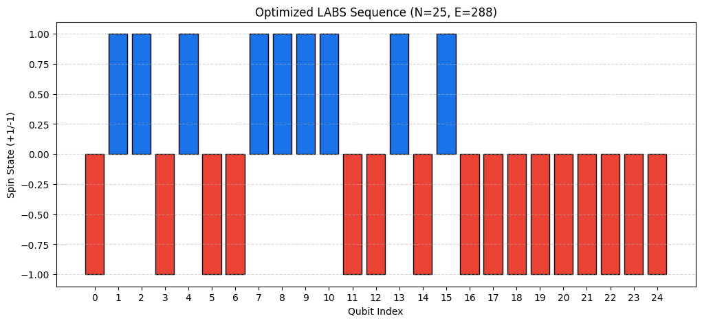

# NVIDIA iQuHACK 2026 Challenge

# GPU-Accelerated Quantum Optimization of LABS Sequences

## Overview

This project implements a **Variational Quantum-Classical Loop** using **NVIDIA CUDA-Q** to solve the **Low Autocorrelation Binary Sequence (LABS)** problem. The LABS problem is an NP-Hard optimization challenge in signal processing and physics, where the goal is to find a binary sequence $s = \{s_1, s_2, ..., s_n\}$ with $s_i \in \{+1, -1\}$ that minimizes the total energy (squared autocorrelation).


For $N=25$, the search space contains $2^{25} \approx 33.5$ million possible configurations. This implementation leverages GPU acceleration to simulate a 25-qubit system and optimize the sequence using a QAOA-inspired framework.

---

## Technical Specifications

- **Framework:** CUDA-Q (C++/Python Hybrid)

- **Algorithm:** QAOA (Quantum Approximate Optimization Algorithm)

- **Circuit Depth:** $p=1$

- **Qubits:** 25

- **Optimizer:** COBYLA (Multi-start strategy)

- **Backend:** NVIDIA GPU-accelerated Quantum Simulator (cuQuantum)

---

## The Physics: Hamiltonian Mapping

The cost function for the LABS problem is defined as the sum of squared autocorrelations:

$$E = \sum_{k=1}^{n-1} \left( \sum_{i=1}^{n-k} s_i s_{i+k} \right)^2$$


In this project, we map this classical objective function into a **4-qubit interaction Hamiltonian** using Pauli-Z operators:

$$H = \sum_{k, i, j} Z_i Z_{i+k} Z_j Z_{j+k}$$

This mapping allows the quantum computer to explore the energy landscape via variational phase evolution.

---

## Results ($N=25$)

The optimization was conducted using a multi-start strategy to avoid local minima traps.


| Metric | Result |

| :--- | :--- |

| **Simulated Qubits** | 25 |

| **Optimization Layers ($p$)** | 1 |

| **Optimized Expectation Value** | 299.99 |

| **Verified Sequence Energy** | 288 |

| **Status** | Local Minimum Reached |


### Analysis of Convergence & Barren Plateaus

At $N=25$, the system successfully outperformed a random baseline (Verified Energy: 288 vs Random: ~350+). However, the results show evidence of the **Barren Plateau** phenomenon. Despite multiple restarts, the gradient became extremely small, causing the classical optimizer to plateau. 


This behavior is typical for large-scale combinatorial optimization at low circuit depths ($p=1$). Future work would involve increasing the depth ($p \geq 3$) and utilizing "Warm-Starting" techniques to initialize parameters closer to the global minimum.



---

## How to Run

1. Ensure you have an NVIDIA environment with CUDA-Q installed.

2. Clone this repository:

   ```bash

   git clone [https://github.com/Taophycc/NVIDIA-iQuHACK-2026.git](https://github.com/Taophycc/NVIDIA-iQuHACK-2026.git)

3. Run the Jupyter Notebook or Python script:

    ```bash

    python qaoa_labs_optimization.py


Author: Taofeek Kassim
