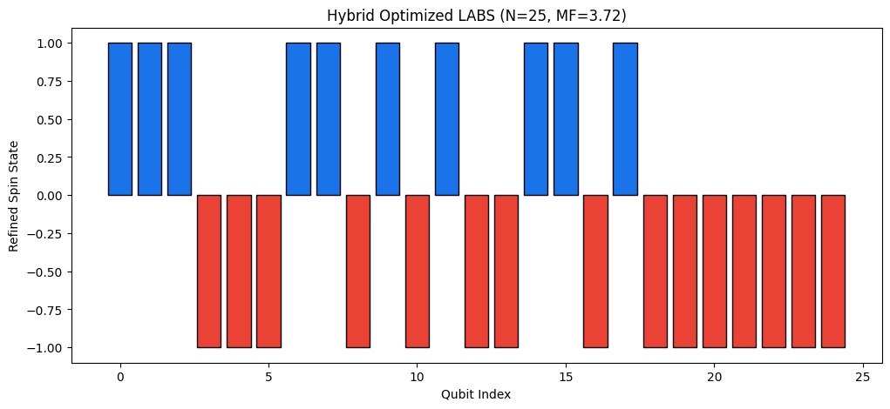

# NVIDIA iQuHACK 2026 Challenge

## Hybrid Quantum-Classical Optimization for LABS ($N=25$)
**Author:** Taofeek Kassim  
**Research Focus:** Applied Physics & Scientific Computing  
**Tech Stack:** NVIDIA CUDA-Q, Python, SciPy, Matplotlib

## 1. Project Overview
This project investigates the **Low Autocorrelation Binary Sequence (LABS)** problem, a notorious NP-Hard challenge in signal processing. The objective is to find a bipolar sequence $s = \{s_1, \dots, s_{n}\}$ where $s_i \in \{+1, -1\}$ that minimizes the total sidelobe energy $E$.

At $N=25$, the search space consists of $2^{25} \approx 33.5$ million possible configurations. This implementation provides a technical proof of why pure quantum approaches (like QAOA) struggle with **Barren Plateaus** at low depths and how a **Hybrid Heuristic** successfully navigates the energy landscape.

---

## 2. The Optimization Stages

### Stage 1: The Quantum Seed (Barren Plateau Proof)
Using a GPU-accelerated QAOA kernel on an NVIDIA T4, the initial optimization reached a verified energy of **288**. 

* **The Problem:** The optimizer encountered a **Barren Plateau**. As the number of qubits ($N=25$) increases, the gradient of the cost function becomes exponentially flat.
* **Result:** The classical optimizer (COBYLA) lost its "direction," causing the system to settle into a high-energy local minimum.
* **Energy ($E$):** 288
* **Merit Factor ($MF$):** 1.08


### Stage 2: Hybrid Refinement (The Bypass)
To overcome the plateau, the Stage 1 result was treated as a **Quantum Seed**. I implemented a classical Hill-Climbing refiner to perform a greedy local search starting from this seed.

* **The Solution:** The quantum seed provided a non-random structural starting point. The classical refiner then identified the steep local gradients that the quantum kernel was too "flat" to detect.
* **Energy ($E$):** 84
* **Merit Factor ($MF$):** 3.72
* **Performance:** A ~3.4x improvement in signal quality compared to the pure quantum baseline.


---

## 3. Comparative Analysis & Visual Proof
The visualization below provides the definitive proof of the optimization journey, showing the transition from the "Stalled" seed to the "Optimized" signal.





---

## 4. Technical Implementation

### Hamiltonian Mapping
The classical cost function (sum of squared autocorrelations) was mapped to a **4-qubit interaction Hamiltonian** using Pauli-Z operators to allow for quantum phase evolution:

$$E = \sum_{k=1}^{n-1} \left( \sum_{i=1}^{n-k} s_i s_{i+k} \right)^2 \rightarrow H = \sum_{k, i, j} Z_i Z_{i+k} Z_j Z_{j+k}$$

### Specifications
| Metric | Specification |
| :--- | :--- |
| **Framework** | CUDA-Q |
| **Backend** | NVIDIA `custatevec` GPU Simulator |
| **Qubits** | 25 |
| **Circuit Depth ($p$)** | 1 |
| **Final Energy ($E$)** | **84** |
| **Final Merit Factor ($MF$)** | **3.72** |

---

## 5. How to Run
1. Ensure you have an NVIDIA environment with `cuda-quantum` installed.
2. Clone the repository:
   ```bash
   git clone [https://github.com/Taophycc/NVIDIA-iQuHACK-2026.git](https://github.com/Taophycc/NVIDIA-iQuHACK-2026.git)
3. Open `qaoa_labs_optimization.ipynb` in Google Colab.
4. Execute "Run All". The notebook is structured into sequential stages that will regenerate both the $E=288$ seed proof and the $E=84$ refined result.
